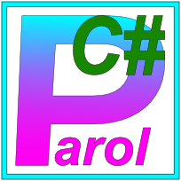

# Parol.Runtime

[](https://www.nuget.org/packages/Parol.Runtime)
[](https://www.nuget.org/packages/Parol.Runtime)
[](https://github.com/jsinger67/parol-dotnet/actions/workflows/ci.yml)
[](https://github.com/jsinger67/parol-dotnet/actions/workflows/nuget-publish.yml)




Runtime library for scanners and LL(k)/LALR(1) parsers generated by the parol ecosystem in .NET.

This package is intended to be consumed by code generated by parol.
Generated LL(k) and LALR(1) parsers include all required scanner and parser tables/data; consumers typically do not define DFA states or parser automata by hand.

## Features

- Runtime support for parol-generated scanners and LL(k)/LALR(1) parsers
- Integration points for generated semantic actions
- Stable package intended for generated code consumption

## Parser Types

- `LL(k)`: Supported via parser code generated by parol.
- `LALR(1)`: Supported via parser code generated by parol.
- In both cases, generated code contains the parser tables/data required by this runtime.

## Installation

```bash
dotnet add package Parol.Runtime
```

## Usage Model

- Generate your LL(k) or LALR(1) parser with parol.
- Use the generated parser and actions in your application.
- The generated code provides all runtime data structures required by this package.

## Target Frameworks

- `netstandard2.0`
- `net8.0`
- `net9.0`
- `net10.0`

## Building

```bash
dotnet build Parol.Runtime.slnx -c Release
```

## Running Tests

```bash
dotnet test Parol.Runtime.slnx
```

## Multi-Target Build and Test Behavior

- `dotnet build` on this solution builds all configured target frameworks for each project.
- `dotnet test` on this solution runs tests for all target frameworks configured in `tests/Parol.Runtime.Tests/Parol.Runtime.Tests.csproj`.
- `netstandard2.0` is build-validated for the runtime project, but tests run on executable runtimes (`net8.0`, `net9.0`, `net10.0`).

If a machine does not have all required SDKs/runtimes installed, commands that run all targets can fail.
Use a framework-specific test command to run one target only:

```bash
dotnet test tests/Parol.Runtime.Tests/Parol.Runtime.Tests.csproj -c Release -f net8.0
```

CI and publish workflows install .NET SDKs `8.0.x`, `9.0.x`, and `10.0.x` and execute tests per target framework.

## Release Notes

See [CHANGELOG.md](CHANGELOG.md).

## Contributing

See [CONTRIBUTING.md](CONTRIBUTING.md).

## Release

- Checklist: [RELEASE.md](RELEASE.md)
- Copy/paste release routine: [RELEASE_TEMPLATE.md](RELEASE_TEMPLATE.md)
